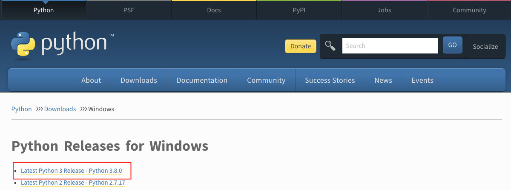

# CURSO BASICO DE PYTHON

## Progamaando con python

|# Clase | Tema                                                    |
|------|:---------------------------------------------------------:|
| 01  |  [Introduccion](./readme.md)|
| 02  |  [Clase 1 Tipos de datos Python](./Clase01/01_python.md)|
| 03  |  [Clase 2 Clases y Funciones Python](./Clase02/02_python.md)|
| 04  |  [Clase 3 Herencia Python](./Clase03/03_python.md)|
| 05  |  [Clase 4 Condicionales Python](./Clase04/04_python.md)|
| 06  |  [Clase 5 Ciclos](./Clase05/05.md)|
| 07  |  [Clase 6.1 Listas Python](./Clase06/06_list_python.md)|
| 08  |  [Clase 6.2 Tuplas Python](./Clase06/06_tuples_python.md)|
| 09  |  [Clase 6.3 Diccionarios Python](./Clase06/06_dict_python.md)|
| 10  |  [Clase 8 Creando App grafica TKINTER](./Clase08/08.md)|
| 11  |  [Clase 9 App para manipulacion de archivos planos](./Clase09/09.md)|
| 12  |  [Clase 10 App grafica con conexion a Mysql](./Clase10/10.md)|
| 13  |  [Clase 11 App CRUD (Listar, Agregar,Actualizar y Eliminar)](./Clase11/11.md)|
| 14  |  [Clase 12 Generar Ejecutable de nuestra App](./Clase12/12.md)|


## Introduccion

Python es un lenguaje de programación de alto nivel para la programación de propósito general. Es un lenguaje de programación de código abierto, interpretado y orientado a objetos. Python fue creado por un programador holandés, Guido van Rossum.

## ¿Por qué Python?

Es un lenguaje de programación muy cercano al lenguaje humano y por eso es fácil de aprender y utilizar.
Python es utilizado por varias industrias y empresas (incluyendo Google). Se ha utilizado para desarrollar aplicaciones web, aplicaciones de escritorio, administración de sistemas y bibliotecas de aprendizaje automático. Python es un lenguaje muy aceptado en la comunidad de la ciencia de datos y el aprendizaje automático. Espero que esto sea suficiente para convencerte de que empieces a aprender Python. Python se está comiendo el mundo y tú lo estás matando antes de que te coma a ti.

## Configurando el ambiente

### Instalando python

Para ejecutar un script python necesitas instalar python. Vamos a [decargar](https://www.python.org/) python.
Si eres usuario de Windows. Haga clic en el botón rodeado en rojo.

[](https://www.python.org/)


Para comprobar si python está instalado escriba el siguiente comando en el terminal de su dispositivo.

```shell
python --version
```
##### El contenido de este repositorio esta basado en la fuente: [Asabeneh S. Yetayeh](https://github.com/Asabeneh/30-Days-Of-Python)
